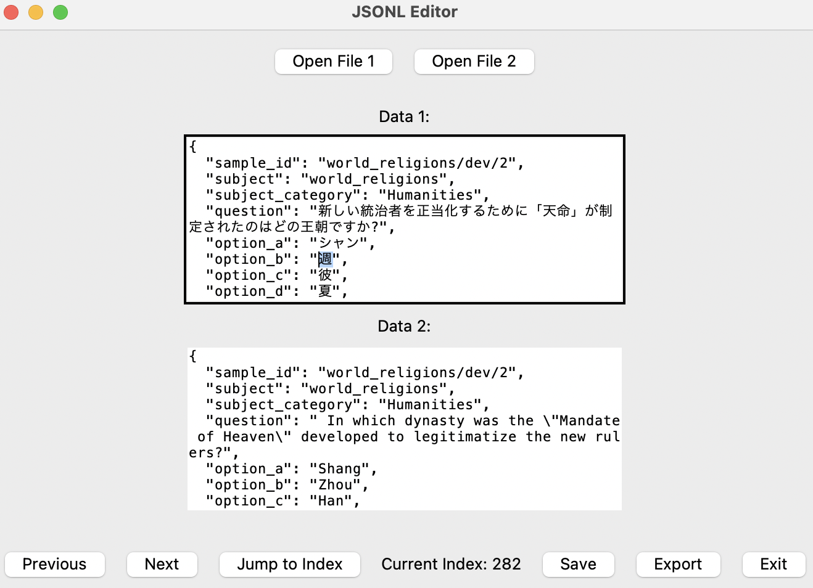

# global_mmlu_edit

📘 Huggingface dataset: https://huggingface.co/datasets/akkikiki/global_mmlu_ja_edited

This repository contains 1) the edited JA dev dataset for Gloabl MMLU, and 2) a simple GUI tool I used to compare with the English version of it.



```
from datasets import load_dataset

# From JSON annotation
ds = load_dataset('json', data_files='data/ja_dev_edited.jsonl')

# or from Huggingface Hub annotation
ds = load_dataset('akkikiki/global_mmlu_ja_edited')

# If migrating with the original Global MMLU, remove additional columns
ds = ds.remove_columns("is_edited")

# load HF dataset
global_mmlu_ja = load_dataset("CohereForAI/Global-MMLU", 'ja')
global_mmlu_ja["dev"] = ds["train"]
```


## Running Annotation/Editing Tool
Env setup
```
conda create -n hf python=3.11
pip install -r requirements
```

Export Global-MMLU EN dataset to JSON
```
python hf_dataset_to_json.py
```

Run
```
python editing_tool.py
```

This editing tool assumes that the file you want to edit it loaded as "File 1" and the reference (e.g., English dev set) is loaded as "File 2".

Make sure to hit "save" after you edit it to save that example, and hit "export" to export all examples.


## References
The original Global-MMLU dataset is at https://huggingface.co/datasets/CohereForAI/Global-MMLU

Original preprint:
```
@misc{singh2024globalmmluunderstandingaddressing,
      title={Global MMLU: Understanding and Addressing Cultural and Linguistic Biases in Multilingual Evaluation}, 
      author={Shivalika Singh and Angelika Romanou and Clémentine Fourrier and David I. Adelani and Jian Gang Ngui and Daniel Vila-Suero and Peerat Limkonchotiwat and Kelly Marchisio and Wei Qi Leong and Yosephine Susanto and Raymond Ng and Shayne Longpre and Wei-Yin Ko and Madeline Smith and Antoine Bosselut and Alice Oh and Andre F. T. Martins and Leshem Choshen and Daphne Ippolito and Enzo Ferrante and Marzieh Fadaee and Beyza Ermis and Sara Hooker},
      year={2024},
      eprint={2412.03304},
      archivePrefix={arXiv},
      primaryClass={cs.CL},
      url={https://arxiv.org/abs/2412.03304}, 
}
```


No preprint as of now for this one. Let me know if I should :)

```
@misc {fujinuma2024mmluv2,
  author = {Fujinuma, Yoshinari},
  title = {JA Revised v2 of Global-MMLU},
  howpublished = {\url{https://huggingface.co/datasets/akkikiki/global_mmlu_ja_edited}},
  url = {https://huggingface.co/datasets/akkikiki/global_mmlu_ja_edited},
  type = {dataset},
  year = {2024},
  month = {Dec},
  timestamp = {2024-12-08},
}
```
